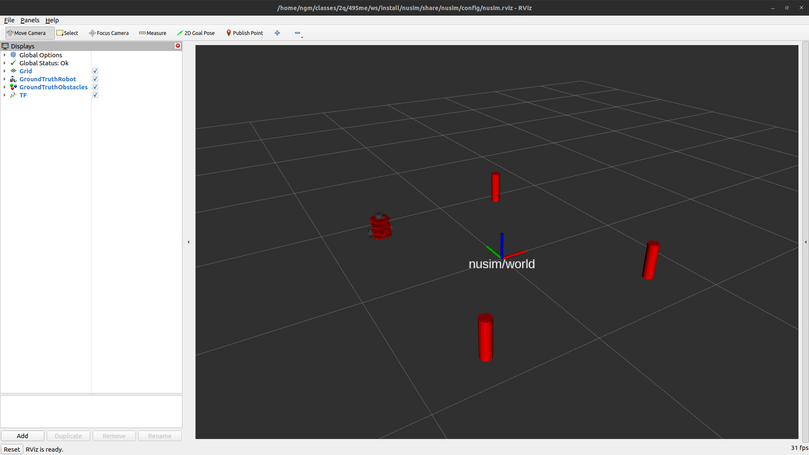

# NUSim 
Simulation package for the nuturtle.
* `ros2 launch nusim nusim.launch.xml` to launch the simulation.



## Launch File Details
* `ros2 launch nusim nusim.launch.xml --show-args` to show arguments for launch file that launches the simulation.

```
Currently there are no arguments for this launch file.
```

## Parameter Details
* `basic_world.yaml` - basic simulation world configuration parameters.
    * `rate` - The rate the simulation runs at (Hz).
    * `x0` - Initial x position of the robot (m).
    * `y0` - Initial y position of the robot (m).
    * `theta0` - Initial rotation of the robot (rad).
    * `obstacles` - parameters for the creation of cylindrical obstacles in the world.
        * `x` - List of x starting positions of obstacles (m). Arbitrary length, but must match length of `y`.
        * `y` - List of y starting positions of obstacles (m). Arbitray length, but must match length of `x`.
        * `r` - Radius of all cylinder obstacles (m). Single value applies to all obstacles.

## Collaboration
I worked alone on this package.