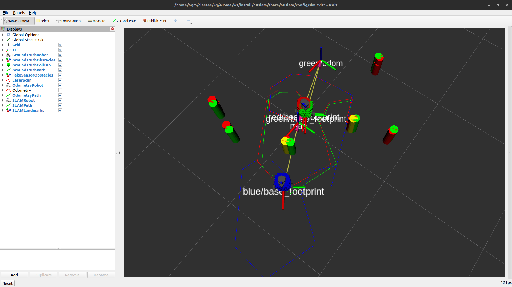

# NUSLAM
A package implementing Extended Kalman Filter SLAM with landmark detection and unknown data association for the NUTurtle with a 2D lidar.

TODO - update this file and add the real robot video.

`ros2 launch nuslam turtlebot_bringup.launch.xml` to launch EKF SLAM using landmark detection and unknown data association on a TurtleBot3.

`ros2 launch nuslam pc_bringup.launch.xml` to bring up corresponding RVIZ nodes to visualize the position of the TurtleBot3.

`ros2 launch nuslam unknown_data_assoc.launch.xml` to launch a simulation with EKF SLAM using landmark detection and unknown data association on lidar data.

`ros2 launch nuslam slam.launch.xml` to launch a simulation with EKF SLAM with fake sensor data for testing EKF SLAM.

`ros2 launch nuslam landmark_detect.launch.xml` to launch a simulation to test landmark detection.

## Demo Video (Simulation)
[EKF SLAM with Landmark Detection and Unknown Data Association](https://user-images.githubusercontent.com/113186159/224628096-42106e8a-a0df-489a-b64e-3a5f029f5f36.webm)

The video is unfortunately choppy due to the screencasting software. The real simulation runs smoothly.

TODO update with better video

### Results
#### Final Poses
##### Ground Truth (Red)
```
x: -0.001 m
y: -0.005 m
θ: -0.028 rad
```

This ground truth data comes from simulation motion of the robot. It is subject to input command noise and slipping and can also crash into obstacles. All these together mean this robot will not follow the theoretical perfect path it is commanded to follow.

##### Odometry Estimate (Blue)
```
x: -0.555 m
y: -0.396 m
θ:  0.030 rad

Positional error: 0.678 m
Rotational error: 0.058 rad
```

This large error is primarily due to the robot crashing into an obstacle during its path (but is also due to slipping when not colliding with an obstacle). Odometry has no way to detect this, and so quite a bit of error is introduced.

##### EKF SLAM with Landmark Detection and Unknown Data Association (Green)
```
x: -0.003 m
y: -0.005 m
θ: -0.036 rad

Positional error: 0.002 m
Rotational error: 0.008 rad
```

The EKF SLAM algorithm also uses odometry data for its prediction of the changing state of the robot. However, it also uses simulated lidar data, processed with supervised and unsupervised learning to detect landmarks. Landmark data is then associated with previously detected data using a Mahalanobis distance threshold. This associated data is then used to correct the odometry prediction and arrive at a much closer estimate to the actual pose of the robot.

## Demo Screenshot (Simulation with Fake Sensor Data)


## Launch File Details
`ros2 launch nuslam turtlebot_bringup.launch.xml --show-args` to show arguments for the launch file that launches EKF SLAM using landmark detection and unknown data association on a TurtleBot3.

```
This launch file currently has no arguments.
```

`ros2 launch nuslam pc_bringup.launch.xml --show-args` to show arguments for the launch file that launches corresponding RVIZ nodes to visualize the position of the TurtleBot3.

```
This launch file currently has no arguments.
```

`ros2 launch nuslam unknown_data_assoc.launch.xml --show-args` to show arguments for the launch file that launches a simulation with EKF SLAM using landmark detection and unknown data association on lidar data.

```
'cmd_src':
        Source for cmd_vel messages. Valid choices are: ['teleop', 'circle', 'none']
        (default: 'teleop')

'robot':
    Simulation or other options for running robot nodes. Valid choices are: ['nusim', 'localhost', 'none']
    (default: 'nusim')

'use_rviz':
    Start RVIZ to visualize robot. Valid choices are: ['true', 'false']
    (default: 'true')
```

`ros2 launch nuslam slam.launch.xml --show-args` to show arguments for launch file that launches the EKF SLAM.

```
'cmd_src':
        Source for cmd_vel messages. Valid choices are: ['teleop', 'circle', 'none']
        (default: 'teleop')

'robot':
    Simulation or other options for running robot nodes. Valid choices are: ['nusim', 'localhost', 'none']
    (default: 'nusim')

'use_rviz':
    Start RVIZ to visualize robot. Valid choices are: ['true', 'false']
    (default: 'true')

'use_fake_sensor':
        Use fake sensor data instead of lidar. Valid choices are: ['true', 'false']
        (default: 'true')
```

`ros2 launch nuslam landmark_detect.launch.xml --show-args` to show arguments for the launch file that launches a simulation to test landmark detection.

```
'cmd_src':
    Source for cmd_vel messages. Valid choices are: ['teleop', 'circle', 'none']
    (default: 'teleop')

'robot':
    Simulation or other options for running robot nodes. Valid choices are: ['nusim', 'localhost', 'none']
    (default: 'nusim')

'use_rviz':
    Start RVIZ to visualize robot. Valid choices are: ['true', 'false']
    (default: 'true')
```

## Parameter Details
* `kalman` - parameters to control the Extended Kalman Filter
    * `process_noise` - parameters to control the Q_bar, process (movement) noise matrix
        * `theta` - Kalman filter process noise for theta coordinate.
        * `x` - Kalman filter process noise for x coordinate.
        * `y` - Kalman filter process noise for y coordinate.
    * `sensor_noise` - Kalman filter sensor noise.
    * `clusters` - parameters to control the supervised learning clustering algorithm.
      * `visualize` - Controls whether clustered points are published as markers.
      * `threshold` - Euclidean distance between points to be considered part of the same cluster.
    * `circles` - parameters to control the unsupervised learning circle regression algorithm.
      * `visualize` - Controls whether fit circles are published as markers.
      * `classification` - parameters for classification of clusters as circles or not circles.
        * `mean_min` - Minimum mean angle for considering a cluster a circle (deg).
        * `mean_max` - Maximum mean angle for considering a cluster a circle (deg).
        * `std_dev_max` - Maximum standard deviation for considering a cluster a circle (deg).
      * `radius_min` - Radius minimum for considering a circle fit as a legitimate circle.
      * `radius_max` - Radius maximum for considering a circle fit as a legitimate circle.
    * `mahalanobis` - parameters to control the Mahalanobis distance data association algorithm.
      * `threshold` - Mahalanobis distance threshold for a new landmark.

## Collaboration
I worked with the following people on this package:
* Katie Hughes